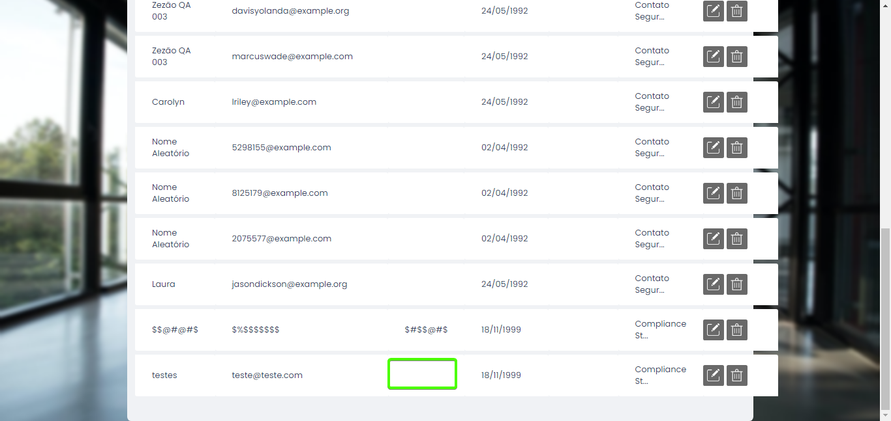

# Documentação de Bugs Encontrados

## Bug 1: Ícone de Edição não abre Modal
**Descrição:**  
Ao clicar no ícone de edição, o sistema não abre nenhuma modal de edição. A tela continua estática na visão inicial.

**Passos para Reproduzir:**
1. Navegue até a lista de usuários.
2. Clique no ícone de edição ao lado de um usuário.
3. Observe que a modal de edição não é exibida.

**Resultado Esperado:**  
O sistema deve abrir uma modal de edição com os campos preenchidos para o usuário selecionado.

**Resultado Atual:**  
Nenhuma modal é exibida, e a tela permanece na visão inicial.

**Impacto:**  
Impossibilita a edição dos registros de usuário, prejudicando a funcionalidade de atualização.

Evidencia em anexo:

---

## Bug 2: Modal de Exclusão não exclui o usuário
**Descrição:**  
Ao clicar no ícone de lixeira/exclusão, o sistema exibe uma modal de alerta com a mensagem "Sucesso! Usuário deletado com sucesso" e um botão de OK. No entanto, após clicar em 'OK', o sistema fecha a modal, mas o usuário não é excluído e continua sendo exibido em tela.

**Passos para Reproduzir:**
1. Navegue até a lista de usuários.
2. Clique no ícone de lixeira/exclusão ao lado de um usuário.
3. Confirme a exclusão na modal de alerta.
4. Observe que o usuário continua na lista mesmo após confirmar.

**Resultado Esperado:**  
O sistema deve remover o usuário da lista após a confirmação da exclusão.

**Resultado Atual:**  
O usuário permanece na lista após a exclusão.

**Impacto:**  
A exclusão de registros não é efetiva, resultando em dados obsoletos.

Evidencia:

-

---

## Bug 3: Mensagem de Preenchimento do Campo 'Telefone' não exibida
**Descrição:**  
O campo 'Telefone' é obrigatório, mas ao deixá-lo em branco, o sistema não exibe nenhuma mensagem de preenchimento.

**Passos para Reproduzir:**
1. Navegue até o formulário de cadastro.
2. Deixe o campo 'Telefone' em branco.
3. Clique em 'Salvar'.

**Resultado Esperado:**  
O sistema deve exibir uma mensagem solicitando o preenchimento do campo 'Telefone'.

**Resultado Atual:**  
Nenhuma mensagem é exibida, e o campo em branco é aceito.

**Impacto:**  
A falta de validação do campo 'Telefone' pode resultar em cadastros incompletos ou incorretos.

-

---

## Bug 4: Campo 'Empresa' não valida exclusão de seleção
**Descrição:**  
Após selecionar uma empresa e excluir a seleção, se o campo 'Empresa' for deixado em branco, o sistema salva o cadastro sem emitir mensagem de alerta e exibe o campo 'Empresa' preenchido nos formulários já cadastrados.

**Passos para Reproduzir:**
1. Selecione uma empresa no campo 'Empresa'.
2. Exclua a seleção, deixando o campo em branco.
3. Clique em 'Salvar'.
4. Verifique os formulários já cadastrados.

**Resultado Esperado:**  
O sistema deve exibir uma mensagem de alerta sobre o campo 'Empresa' estar em branco e não permitir o salvamento.

**Resultado Atual:**  
O sistema salva o cadastro com o campo 'Empresa' em branco e exibe o campo preenchido nos registros.

**Impacto:**  
Pode resultar em cadastros inconsistentes com dados incorretos.

---

## Bug 5: Falta de Responsividade no Modal de 'Novo Usuário' quando o zoom está em 100%
**Descrição:**  
O sistema não é responsivo. Ao abrir o modal de 'Novo Usuário' e clicar no campo 'Empresa', o sistema exibe apenas duas empresas, mesmo havendo três opções disponíveis.

**Passos para Reproduzir:**
1. Abra o modal de 'Novo Usuário'.
2. Clique no campo 'Empresa'.
3. Observe que apenas duas empresas são exibidas.

**Resultado Esperado:**  
O modal deve exibir todas as opções de empresas disponíveis.

**Resultado Atual:**  
Apenas duas empresas são exibidas.

**Impacto:**  
A falta de responsividade prejudica a seleção completa das opções disponíveis.

Evidencia:

---

## Bug 6: Campo de Data com Dados Inválidos
**Descrição:**  
O sistema quebra quando o campo de data é preenchido com dados inválidos, como 22/22/2000.

**Passos para Reproduzir:**
1. Navegue até o formulário de cadastro.
2. Preencha o campo de data com uma data inválida (ex: 22/22/2000).
3. Tente salvar o formulário.

**Resultado Esperado:**  
O sistema deve exibir uma mensagem de erro informando que a data é inválida.

**Resultado Atual:**  
O sistema quebra e não permite o salvamento.

**Impacto:**  
Prejudica a integridade dos dados e a usabilidade do sistema.

Evidencia: Não foi possivel capturar a evidencia

---

## Bug 7: Campo 'Nome', 'Email' e 'Telefone' permite preenchimento apenas de Números e Caracteres Especiais
**Descrição:**  
O campo 'Nome', 'Email' e 'Telefone'  permite o preenchimento apenas com números e caracteres especiais, o que não deveria ser permitido.

**Passos para Reproduzir:**
1. Navegue até o formulário de cadastro.
2. Preencha o campo 'Nome', 'Email' e 'Telefone'  com números e caracteres especiais.
3. Tente salvar o formulário.

**Resultado Esperado:**  
O sistema deve exibir uma mensagem de erro indicando que os campos 
- 'Nome' deve conter apenas letras .
- 'Email' deve aceitar letras, número e caracteres especias
- 'Telefone' deve aceitar apenas números

**Resultado Atual:**  
O sistema aceita números e caracteres especiais no campo 'Nome', 'Email' e 'Telefone' .

**Impacto:**  
Permite a entrada de dados inválidos, o que pode afetar a integridade do banco de dados e a experiência do usuário.

Evidencia:

-

